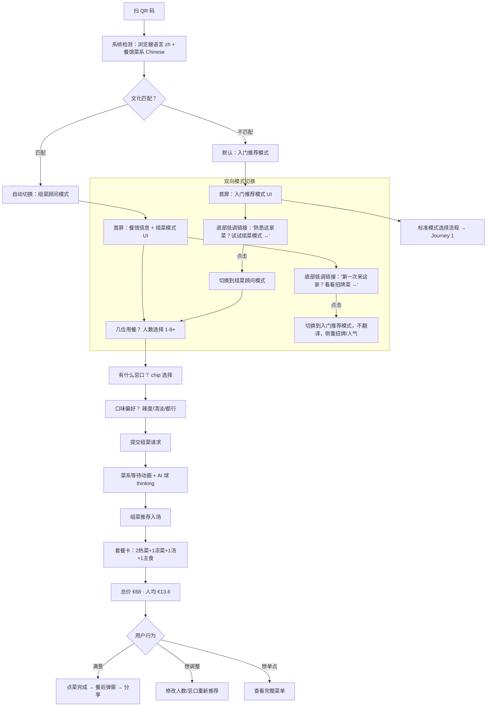
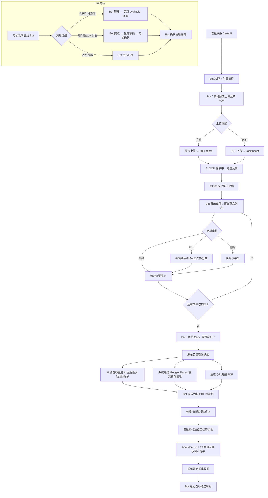
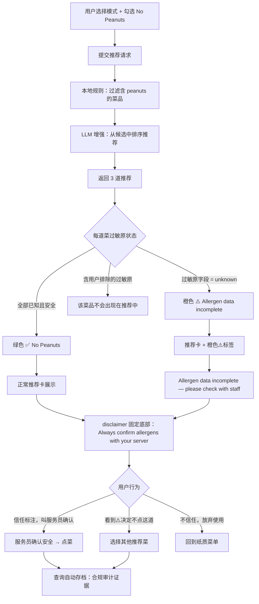

---
stepsCompleted:
  - "step-01-init"
  - "step-02-discovery"
  - "step-03-core-experience"
  - "step-04-emotional-response"
  - "step-05-inspiration"
  - "step-06-design-system"
  - "step-07-defining-experience"
  - "step-08-visual-foundation"
  - "step-09-design-directions"
  - "step-10-user-journeys"
  - "step-11-component-strategy"
  - "step-12-ux-patterns"
  - "step-13-responsive-accessibility"
  - "step-14-complete"
lastStep: 14
inputDocuments:
  - "planning-artifacts/prd.md"
  - "planning-artifacts/product-brief-carte-ai-distillate.md"
  - "docs/index.md"
  - "docs/architecture.md"
  - "docs/component-inventory.md"
  - "docs/data-models.md"
  - "docs/api-contracts.md"
---

# UX Design Specification - CarteAI

**Author:** Boyuan
**Date:** 2026-05-04

---

<!-- UX design content will be appended sequentially through collaborative workflow steps -->

## Executive Summary

### Project Vision

CarteAI 的 UX 核心使命：让顾客在 10 秒内从"看不懂菜单"到"自信点菜"，让老板在零学习成本下看到数据回报。

产品有两个截然不同的界面：顾客端（移动 web，餐桌扫码场景）和管理端（桌面为主，Dashboard + 菜单管理）。两端共享品牌视觉语言但服务完全不同的心理状态——顾客端追求"温暖、可信、快速决策"，管理端追求"清晰、高效、数据驱动"。

### Target Users

| 用户角色 | 使用场景 | 技术水平 | 主设备 | 核心心理 |
|---------|---------|---------|-------|---------|
| 外国游客 | 餐馆内，看不懂菜单 | 低-中 | 手机 | 焦虑 → 快速获得可信推荐 |
| 同文化食客 | 餐馆内，选菜搭配 | 中 | 手机 | 轻松但选择困难 → 省心组菜 |
| 餐馆老板 | 店内/家中管理 | 低 | 手机为主 | 忙碌没耐心 → 零学习成本 |
| 创始人/Admin | 远程运维监控 | 高 | 桌面 | 全局掌控 → 异常下钻 |

### Key Design Challenges

1. **10 秒决策管道**：扫码 → 语言检测 → 模式选择 → 限制勾选 → 3 秒等待 → 推荐结果。每多一步都是流失。需要极致精简的交互步骤和认知负载。
2. **双模式无缝切换**：文化感知自动检测会误判。双向切换按钮的 progressive disclosure 挑战——"低调到不碍事，需要时一眼找到"。
3. **过敏原信任 vs 恐惧**：`unknown` ⚠️ + disclaimer 必须视觉优先级不低于推荐内容，但不能吓跑用户。安全感和食欲的平衡。
4. **推荐卡信息密度**：菜名（原名+翻译）+ AI 图片 + 价格 + 理由 + 信心评分 + 过敏原——在一张移动端卡片内不拥挤地呈现。
5. **老板端零学习曲线**：从 JSON textarea 重构为表单化菜单编辑 + 完整 Dashboard，目标用户是抗拒"登录后台系统"的法国小店老板。
6. **AI 生成图片的视觉诚信**："AI Generated · For Reference" 标识要建立信任但不破坏食欲感。

### Design Opportunities

1. **温暖化品牌重塑**：现有 UI 赛博感有余、餐馆暖味不足。Phase 1 将深色基底调暖，推荐卡增加食物摄影质感（暖光、纹理），AI Concierge 措辞从工具语气转为"朋友推荐"。
2. **菜系动态配色系统**：以 Google Maps 餐馆类型（`chinese_restaurant`、`french_restaurant`、`indian_restaurant` 等）为 key，预定义完整配色模板库。数据在 FR10 Google Places 搜索时自动获取，无需老板手动选择。Phase 1 用 CSS 变量 / Tailwind theme token 架构，后期零重构接入。每家店自动获得与菜系匹配的视觉风格，强化归属感。
3. **AI Concierge 人格化**：强化现有脉冲光球的"助手"人格——不是冷冰冰的搜索引擎，是"懂行的朋友帮你点菜"。直接支撑文化感知模式切换的 Aha Moment。
4. **Dashboard 即销售工具**：老板看到的不是"数据面板"，是"投资回报证明"。做好了 Dashboard 数据本身就是续费理由和转介绍素材。

## Core User Experience

### Defining Experience

CarteAI 的灵魂体验是**顾客扫码后的 10 秒**——从"看不懂菜单"到"自信点菜"。这 10 秒内发生的一切决定了产品的存亡。

顾客端提供两条平行交互路径，殊途同归：

- **快捷路径**（按钮驱动）：扫码 → 首屏（餐馆信息 + 模式按钮）→ 勾限制 → 等待动画 → 推荐结果。适合目标明确、赶时间的用户，全程 ≤10 秒。
- **对话路径**（AI 角色驱动）：扫码 → 首屏 → 点击 AI Concierge 角色 → 语音或文字自由对话 → AI 引导式提问 → 推荐结果。适合不确定需求、想要"朋友帮忙点菜"体验的用户。

两条路径共享同一个推荐引擎（本地规则 + LLM 增强），输入方式不同但推荐质量一致。

老板端（B 端）的灵魂体验是**第一次看到自己菜单被 AI 展示的那一刻**——19 种语言、带图片、带推荐理由。这是付费转化的关键时刻。

### Platform Strategy

| 维度 | 决策 |
|------|------|
| 顾客端 | 移动优先 Web（100% 手机扫码场景），无需下载 |
| 管理端 | 响应式 Web，桌面优先但手机可用（老板可能在店里手机操作） |
| 触控 vs 键鼠 | 顾客端纯触控设计；管理端混合 |
| 离线 | 不需要——餐馆内有 WiFi 或移动网络 |
| 设备能力 | Web Speech API（语音输入）、摄像头（菜单拍照上传） |

### Effortless Interactions

**自动化（用户无需操作）：**
- 浏览器语言自动检测 → 界面语言 + 推荐语言自动切换
- 文化感知模式自动匹配（可手动覆盖）
- 菜系动态配色 + 特色动画自动加载
- 菜品无图自动触发 AI 图片生成

**零思考操作：**
- 模式选择用大按钮 + 图标，不需要阅读说明
- 过敏原排除用 chip toggle，点一下就完成
- AI 对话角色浮在页面角落，想聊就点，不想就忽略

**消除的步骤（vs 竞品）：**
- 无注册/登录
- 无下载 App
- 无打字搜索菜名
- 无翻页浏览完整菜单

### Critical Success Moments

| 时刻 | 描述 | 失败后果 |
|------|------|---------|
| **扫码首屏** | 顾客看到餐馆信息 + 温暖配色 + 语言自动对 → "这个懂我" | 语言错/加载慢 → 直接关闭 |
| **推荐等待** | 菜系特色动画（筷子转/飞饼跑）→ "好可爱" | 白屏/无聊转圈 → 失去耐心 |
| **推荐呈现** | 3 道菜 + 图片 + 理由 + 价格 → "就点这个" | 信息杂乱/图片不对 → 不信任 |
| **AI 对话** | 点角色 → 自然对话 → 被引导推荐 → "像朋友在帮我" | 对话卡顿/答非所问 → 失望 |
| **过敏原安全** | 清晰标注 + disclaimer → "至少不会害我" | ⚠️ 不明显/不可见 → 安全风险 |
| **老板首见** | 自己菜单 19 种语言展示 → "太酷了" | 提取错误多 → 不信任 AI |

### Experience Principles

1. **10 秒法则**：从扫码到看到推荐，快捷路径 ≤10 秒。任何增加步骤的需求必须用减少其他步骤来补偿。
2. **活的界面**：页面充满微交互和过渡动画——等待动画有文化特色、按钮有反馈、卡片有入场效果。静态页面 = 死页面。
3. **双通道选择**：不强迫用户用一种方式交互。想快就点按钮，想聊就找 AI 角色。两条路都通向好推荐。
4. **信任优先于炫酷**：过敏原安全 > 视觉效果。disclaimer 永远可见，⚠️ 标签不会被动画遮挡，AI 图片明确标注"仅供参考"。
5. **每家店都独特**：菜系配色 + 特色动画 + 餐馆信息 → 每家店的 CarteAI 页面看起来都不一样，老板有归属感，顾客有新鲜感。

### 首屏评分展示策略

- Google Places 评分 ≥4.5：展示评分 + 星级
- Google Places 评分 <4.5：隐藏评分，仅展示餐馆名 + 菜系 + 地址
- 无评分数据：不展示评分区域

### 菜系特色等待动画系统

以 Google Maps 餐馆类型为 key，每种类型对应独特的等待动画：

| 餐馆类型 | 动画元素（示意） |
|---------|----------------|
| `chinese_restaurant` | 筷子旋转夹菜 |
| `indian_restaurant` | 飞饼奔跑 / 香料旋转 |
| `french_restaurant` | 红酒杯优雅摇晃 |
| `italian_restaurant` | 面条跳舞 / 披萨旋转 |
| `japanese_restaurant` | 寿司翻滚 / 筷子夹寿司 |
| `korean_restaurant` | 烤肉滋滋冒烟 |
| `thai_restaurant` | 椰子叶摆动 / 辣椒跳跃 |
| `mexican_restaurant` | Taco 翻转 / 辣椒摇摆 |
| 其他/通用 | 刀叉交叉旋转 + 盘子冒热气 |

动画与菜系配色系统联动——同一个 `restaurant_type` key 驱动配色 + 等待动画 + 页面装饰元素。

### AI Concierge 对话角色

**角色定位**：一个会说 19 种语言的美食朋友，不是客服机器人。

**视觉呈现**：
- 浮动在页面右下角的动画角色头像（类似豆包风格）
- 有表情变化——待机微笑、思考时眨眼、推荐时兴奋
- 点击展开对话面板（底部弹出，不覆盖全屏）

**交互方式**：
- 文字输入：自由描述需求（"我想吃辣的但不要太贵"）
- 语音输入：Web Speech API，按住说话
- AI 引导式对话："几位用餐？""有什么忌口？""想尝试新口味还是经典款？"

**与快捷路径的关系**：
- 快捷路径是默认主线——按钮 + chip 操作
- AI 角色始终可见但不抢戏——用户主动点击才展开
- 两条路径可以混合使用：先选了"第一次来"，再跟 AI 补充"但我不吃辣"

## Desired Emotional Response

### Primary Emotional Goals

| 情感目标 | 描述 | 为什么关键 |
|---------|------|-----------|
| **温暖被理解** | "这个懂我" — 语言自动对、推荐理由贴心 | 核心差异化：不是冷冰冰的翻译器，是温暖的朋友 |
| **自信决策** | "就点这个" — 从不知道点啥到 3 秒做决定 | 产品存在的根本理由 |
| **愉悦惊喜** | "好可爱/好有趣" — 动画、配色、AI 角色 | 驱动分享和复访 |
| **安全信任** | "至少它不骗我" — 过敏原诚实、AI 图片标注 | 健康安全的底线 |

### Emotional Journey Mapping

| 阶段 | 用户状态 | 目标情感 | 设计手段 |
|------|---------|---------|---------|
| 扫码瞬间 | 好奇但犹豫 | 惊喜 + 好奇 | 菜系配色暖场 + 餐馆信息建立信任 |
| 模式选择 | 不确定需求 | 轻松 + 无压力 | 大按钮 + 图标直觉化；或点 AI 角色对话 |
| 等待推荐 | 可能不耐烦 | 愉悦 + 期待 | 菜系特色动画（筷子转/飞饼跑）把等待变快乐 |
| 看到推荐 | 评估中 | 自信 + 信任 | 图片 + 母语理由 + 价格 + 过敏原一目了然 |
| AI 对话 | 想要帮助 | 温暖 + 被理解 | 动画角色表情变化 + 自然语言引导 |
| 过敏原场景 | 担忧安全 | 安全感 + 诚实 | ⚠️ 清晰标注 + disclaimer 永远可见 |
| 出错/降级 | 可能受挫 | 稳定 + 无感 | 静默降级到本地规则，UI 无任何异常 |
| 餐后弹窗 | 满足/放松 | 轻松参与 | 温和弹窗，一键 Yes/No，不强制 |
| 离开/分享 | 满意想走 | 留恋 + 想分享 | 一键社交分享（精美推荐卡 + 餐馆链接） |

### Social Sharing（离开时刻转化）

**触发时机**：餐后采纳弹窗回答后，或推荐页停留一段时间后，底部浮现分享提示。

**分享渠道**：
- Instagram Stories / Post
- Facebook
- Snapchat
- X (Twitter)
- WhatsApp（欧洲高频）
- 通用链接复制

**分享内容**：
- 自动生成精美推荐卡图片（菜品图 + 菜名 + 餐馆名 + "Recommended by AI"）
- 附带餐馆 CarteAI 页面链接（`carte-ai.link/r/[slug]`）
- 预填文案可编辑（多语言）："在 [餐馆名] 让 AI 帮我点菜，推荐太准了！"

**增长飞轮**：每次分享 = 免费广告 → 朋友看到 → 下次去该餐馆也扫码 → 老板看到社交曝光数据更愿续费。

### Micro-Emotions

| 正面微情感（追求） | 负面微情感（坚决避免） |
|------------------|---------------------|
| 好奇："这是什么？扫一下看看" | 困惑："我该点哪里？" |
| 惊喜："居然自动识别我的语言" | 冷漠："又一个翻译工具" |
| 愉悦："这个等待动画好可爱" | 不耐烦："怎么还没出来" |
| 自信："这几道菜就是我想要的" | 怀疑："这推荐靠谱吗？" |
| 信任："过敏原标注很诚实" | 恐惧："万一过敏原标错了？" |
| 归属："这个页面很有这家店的感觉" | 疏离："跟餐馆没关系的通用页面" |
| 分享欲："朋友们一定觉得这个很酷" | 无感："用完就忘" |

### Design Implications

| 情感目标 | UX 设计策略 |
|---------|-----------|
| 温暖被理解 | AI Concierge 对话用"朋友语气"而非"客服语气"；菜系配色营造归属感 |
| 自信决策 | 推荐卡信息完整（图+名+价+理由+过敏原）一卡解决，不需翻页查找 |
| 愉悦惊喜 | 菜系特色等待动画 + 入场过渡动效 + AI 角色表情反馈 |
| 安全信任 | disclaimer 视觉权重不低于推荐内容；unknown 过敏原用醒目⚠️；AI 图片标注清晰 |
| 分享欲望 | 推荐卡生成为精美可分享图片；一键多平台分享；分享文案预填可编辑 |
| 稳定无感 | 所有降级路径（LLM 挂、图片生成失败）静默处理，用户零感知 |

### Emotional Design Principles

1. **温暖 > 炫酷**：每个设计决策先问"这让用户觉得温暖吗？"而非"这看起来酷吗？"。动画是为了愉悦不是为了炫技。
2. **诚实建立信任**：不隐藏不确定性——AI 图片标"仅供参考"，过敏原 unknown 标⚠️，信心评分透明展示。诚实的产品让人信任。
3. **愉悦的等待**：任何系统延迟（推荐生成、图片加载）都是设计愉悦微时刻的机会，不是需要"忍受"的空白。
4. **分享是自然结果**：如果体验足够好，用户自然想分享。分享功能不是"求你分享"，是"帮你分享"——精美卡片 + 一键操作。
5. **情感连续性**：从扫码到分享，情感曲线不中断。不能在愉悦的推荐后突然弹出冷冰冰的弹窗。

## UX Pattern Analysis & Inspiration

### Inspiring Products Analysis

| 产品 | 借鉴维度 | 核心 UX 洞察 |
|------|---------|-------------|
| **豆包 / Character.AI** | AI 对话角色 | 动画头像 + 表情状态机（思考/开心/困惑）让 AI 有人格感。对话面板从底部弹出不覆盖全屏，保持上下文。语音输入按住即说，松手即发。 |
| **Spotify Daily Mix** | 个性化推荐呈现 | 不给用户 100 首歌的列表，给 6 张精选卡片 + "Because you listened to..."。推荐理由比推荐本身更重要——用户要的是"为什么推荐这个"的信心。 |
| **Uber Eats / 美团** | 食物卡片视觉 | 大图占卡片 60%+、暖光食物摄影、价格醒目、标签 chip（热门/新品/折扣）。食物类产品的视觉标准：图片必须让人有食欲。 |
| **Duolingo** | 趣味动画 + 角色 | Duo 猫头鹰的微表情让整个学习过程不枯燥。等待/加载/成功/失败都有对应动画。证明：动画角色 + 微交互可以把功能性产品变成情感产品。 |
| **Google Maps 地点卡** | 首屏信息层级 | 地点名（大字）→ 评分 + 类型（一行）→ 地址（灰字）。3 层信息在 2 秒内扫完。CarteAI 首屏的餐馆信息可以直接复用这个层级。 |

### Transferable UX Patterns

**导航与信息架构：**
- **Google Maps 信息层级** → 首屏餐馆信息：大字餐馆名 → 菜系 + 评分（≥4.5）→ 地址。3 层 2 秒扫完
- **Spotify 精选卡片** → 推荐结果不超过 4 张卡片，不做无限滚动列表。少即是多

**交互模式：**
- **豆包底部弹出对话面板** → AI Concierge 点击后底部弹出，不全屏覆盖，用户随时可以收起回到按钮模式
- **Duolingo 选择 chip** → 过敏原/饮食限制用彩色 chip toggle，点一下高亮，再点取消。零文字输入
- **Uber Eats 横滑卡片** → 推荐结果用横向滑动卡片组，暗示"还有更多"，但首屏已经够用

**视觉设计：**
- **美团食物摄影标准** → 菜品图片（真实或 AI 生成）必须暖光、有食欲感、占卡片主视觉面积
- **Spotify 渐变背景** → 菜系配色系统可以借鉴 Spotify 专辑封面提取主色做渐变背景的思路——用餐馆类型 key 驱动渐变色
- **Duolingo 角色表情系统** → AI Concierge 角色状态：idle（微笑）→ thinking（眨眼 + 冒泡）→ excited（推荐出来了！）→ concerned（过敏原警告）

**微交互与动效：**
- **Duolingo 成功反馈** → 推荐卡入场时有轻微弹跳动效 + 卡片间依次入场（staggered animation），不是一次性全部出现
- **Character.AI 打字效果** → AI 对话回复用逐字/逐句出现效果，而非瞬间全显，增加"正在思考"的人格感

### Anti-Patterns to Avoid

| 反模式 | 为什么避免 | CarteAI 的替代方案 |
|--------|-----------|------------------|
| **无限滚动菜单列表** | 顾客不是来浏览完整菜单的，是来要推荐的 | 最多 4 张精选推荐卡 |
| **冷冰冰的聊天机器人 UI**（灰色气泡 + 打字框） | 破坏温暖感，让人觉得在跟客服对话 | 动画角色 + 彩色对话面板 + 菜系配色 |
| **过度请求权限**（通知/位置/摄像头弹窗轰炸） | 扫码后第一件事是拒绝弹窗 = 体验灾难 | 零权限请求。语音是用户主动点按钮，不预请求麦克风 |
| **强制分享弹窗** | "分享给朋友获得奖励！" = 被嫌弃 | 分享是自然浮现的选项，不是拦路弹窗 |
| **骨架屏/灰色占位**（加载中） | 无聊、焦虑、感觉慢 | 菜系特色趣味动画替代所有加载状态 |
| **密密麻麻的 Dashboard 数字墙** | 老板看不懂、不想看 | 大数字 + 趋势箭头 + 颜色编码，一眼看懂 |

### Design Inspiration Strategy

**Adopt（直接采用）：**
- Duolingo 的角色表情状态机 → AI Concierge 的情感表达系统
- Google Maps 的 3 层信息层级 → 首屏餐馆信息展示
- 美团/Uber Eats 的暖光食物卡片标准 → 推荐卡视觉基线

**Adapt（调整后采用）：**
- Spotify 的专辑色提取 → 改为按 Google Maps 餐馆类型 key 预定义配色方案
- 豆包的对话面板 → 简化为底部半屏弹出，增加语音按钮，对话风格从"助手"调整为"朋友"
- Character.AI 的逐字效果 → 仅在 AI 对话路径中使用，快捷路径的推荐卡用弹跳入场效果

**Avoid（明确不做）：**
- 任何需要注册/登录的交互模式
- 任何全屏覆盖的弹窗（对话面板、分享面板都是半屏）
- 完整菜单浏览作为主导航模式——CarteAI 的主路径是推荐，但提供"查看完整菜单"次要入口

## Design System Foundation

### Design System Choice

**Tailwind 4 + shadcn/ui + 三层动画架构（Rive + Lottie + Framer Motion）**

这是一个"组合式"设计系统策略——用成熟的开源组件加速开发，同时保留完全的视觉定制能力。

### Rationale for Selection

| 选择 | 理由 |
|------|------|
| **Tailwind 4** | 已在项目中使用；CSS 变量原生支持菜系动态配色；utility-first 与 shadcn/ui 天然配合 |
| **shadcn/ui** | 组件源码复制到本地（非 npm 黑盒），完全可控可改。Dialog、Sheet、Card、Button、Toggle、Toast 等直接用，1 周 MVP 必须的效率保证 |
| **Rive** | AI Concierge 角色的表情状态机（idle → thinking → excited → concerned），支持交互式状态切换，比 Lottie 更适合有状态的角色动画 |
| **Lottie** (lottie-react) | 菜系特色等待动画（筷子转/飞饼跑/红酒摇），After Effects → JSON 格式极小（几 KB），社区有丰富食物类动画素材可复用和定制 |
| **Framer Motion** | UI 层微交互——卡片入场弹跳（staggered）、页面过渡、Sheet 弹出收起、chip toggle 反馈、列表重排动画 |

**不选的方案：**
- MUI / Chakra UI：样式系统与 Tailwind 冲突，覆盖成本高，bundle 重
- 纯 CSS 动画：无法实现复杂角色状态机和插画级动效
- 纯 Framer Motion：UI 动画强，但插画级动画（角色表情、食物动画）不是其强项

### Implementation Approach

**三层动画架构：**

| 层 | 技术 | 职责 | 示例 |
|----|------|------|------|
| 角色层 | Rive | AI Concierge 表情状态机 | idle 微笑 → thinking 眨眼冒泡 → excited 推荐完成 → concerned 过敏原警告 |
| 插画层 | Lottie | 菜系特色等待动画 + 装饰元素 | 中餐筷子旋转、法餐红酒摇晃、通用刀叉转圈 |
| UI 层 | Framer Motion | 组件级微交互 + 页面过渡 | 卡片 staggered 入场、Sheet 弹出、chip 切换反馈 |

**组件库策略（shadcn/ui）：**

| 需要的组件 | 用途 |
|-----------|------|
| Sheet (底部弹出) | AI 对话面板、分享面板 |
| Card | 推荐卡、菜品卡 |
| Button | 模式选择、操作按钮 |
| Toggle / Chip | 过敏原排除、饮食限制 |
| Dialog | 餐后采纳弹窗 |
| Toast | 操作反馈 |
| Tabs | 菜单分类浏览、Dashboard 切换 |
| Table | Dashboard 数据表 |
| Chart（需额外引入） | Dashboard 趋势图（Recharts 或 Tremor） |

### Customization Strategy

**菜系动态配色（CSS 变量驱动）：**

```css
/* 默认主题（通用） */
:root {
  --carte-bg: #0a0a0f;
  --carte-primary: theme(colors.amber.300);
  --carte-accent: theme(colors.orange.200);
  --carte-glow: theme(colors.amber.400/20);
  --carte-surface: theme(colors.white/0.06);
}

/* 中餐主题 */
[data-cuisine="chinese"] {
  --carte-primary: theme(colors.red.400);
  --carte-accent: theme(colors.amber.300);
  --carte-glow: theme(colors.red.400/20);
}

/* 法餐主题 */
[data-cuisine="french"] {
  --carte-primary: theme(colors.blue.300);
  --carte-accent: theme(colors.amber.100);
  --carte-glow: theme(colors.blue.300/20);
}

/* 印度菜主题 */
[data-cuisine="indian"] {
  --carte-primary: theme(colors.orange.400);
  --carte-accent: theme(colors.yellow.300);
  --carte-glow: theme(colors.orange.400/20);
}
```

页面根元素通过 `data-cuisine={restaurant.type}` 属性切换主题，所有组件通过 CSS 变量自动响应。Phase 1 预定义 8-10 种菜系主题 + 1 个通用默认主题。

**温暖化视觉调整（vs 现有赛博风）：**
- 底色从纯黑 `#050507` 调整为带暖调的深色 `#0a0a0f`
- 主品牌色从冷绿 emerald 调整为暖色调（默认 amber/orange，按菜系变化）
- 玻璃面板增加暖光渐变
- 字体保持 Geist Sans/Mono，但正文增大行高提升可读性

## Defining Core Interaction

### Defining Experience

**一句话**："扫码，3 秒出推荐，就点这个。" — Scan to Eat。

**用户会怎么跟朋友描述**：
- 外国游客："I scanned the QR code and it told me what to order — in English, with pictures!"
- 中国食客："扫一下它就帮我配好菜了，比自己看菜单强多了"
- 老板："顾客扫一下就知道点什么，我多卖了几道利润高的菜"

### User Mental Model

**顾客当前怎么解决"不知道点什么"：**

| 现有方案 | 用户感受 | CarteAI 替代 |
|---------|---------|-------------|
| 问服务员 | 高峰时段等很久；语言不通尴尬 | AI 即时推荐，19 种语言 |
| 看 TripAdvisor/大众点评 | 出发前查，到店后菜名对不上 | 扫码当场推荐，菜名精准对应 |
| 指着别桌的菜说"要那个" | 碰运气，可能踩雷 | AI 个性化推荐 + 过敏原保护 |
| 随便点 | 焦虑，可能浪费钱 | 有理由、有信心、有价格 |

**用户心智模型**：顾客不把 CarteAI 理解为"AI 工具"，而是"一个懂行的朋友帮我点菜"。这个心智模型决定了所有交互的语气和方式——不是搜索引擎给结果，是朋友给建议。

### Success Criteria

| 维度 | 成功标志 | 失败信号 |
|------|---------|---------|
| 速度 | 扫码到看到推荐 ≤10 秒 | 超过 15 秒用户开始翻纸质菜单 |
| 信心 | 用户看完推荐直接叫服务员点菜 | 用户看完推荐后又去翻菜单对比 |
| 理由 | 用户读了推荐理由觉得"说的有道理" | 理由太通用，像模板生成 |
| 安全 | 过敏用户信任标注，跟服务员确认后点菜 | 过敏用户看到推荐后不敢点 |
| 分享 | 用户主动截图或使用分享功能 | 用完即走，不记得用过 |

### Novel UX Patterns

**创新 + 熟悉的组合策略：**

| 交互 | 模式类型 | 说明 |
|------|---------|------|
| QR 扫码进入 | 已建立 | 后疫情标准动作，零教育成本 |
| 模式选择按钮 | 已建立 | 类似外卖 App 分类入口，用户秒懂 |
| 过敏原 chip toggle | 已建立 | 类似筛选标签，一点即选 |
| **文化感知自动模式切换** | 创新 | 用户未见过——需要通过结果的显著不同来让用户感知"这个懂我" |
| **双向模式切换按钮** | 微创新 | 低调入口，不需要教育——想切的人自然会找到 |
| **AI 对话角色** | 创新 | 餐馆场景中的 AI 对话是新的——用角色人格化降低学习成本 |
| **菜系特色等待动画** | 创新 | 把等待变成"这家店的特色体验"——没见过但一看就懂 |
| **完整菜单浏览入口** | 已建立 | 推荐下方"查看完整菜单"——给想自己选的用户退路 |

**教育策略**：创新交互不需要单独教育——文化感知模式通过结果差异自然展现；AI 角色用动画邀请（微笑 + 冒泡"需要帮忙？"）引导；模式切换按钮低调存在等被发现。

### Experience Mechanics

**快捷路径（主线）：**

```
1. INITIATION
   用户扫 QR → 浏览器打开 /r/[slug]
   系统：检测浏览器语言 → 加载菜系配色 → 加载餐馆信息
   首屏呈现：餐馆名 + 菜系 + 评分(≥4.5) + 菜系暖色背景

2. INTERACTION
   用户看到 5 个模式大按钮（图标+文字）：
   🆕 第一次来 | 💰 ≤10€ | ⭐ 招牌菜 | 🥗 健康 | 🍻 分享
   点选一个 → 展开限制 chip 区：
   🚫 不辣 | 🥬 素食 | 🐄 不吃牛 | 🦐 不吃海鲜 | 🥛 无奶 | 🌾 无麸质
   可选：点击"查看完整菜单"进入分类浏览

3. FEEDBACK
   提交 → 菜系特色等待动画（3 秒）
   AI Concierge 角色状态：thinking（眨眼冒泡）
   推荐卡依次弹跳入场（staggered，每张间隔 200ms）

4. COMPLETION
   3~4 张推荐卡呈现：
   [菜品图(暖光)] [菜名(原名+翻译)] [价格]
   [一句话理由] [信心评分] [过敏原状态]
   底部固定：disclaimer "请向服务员确认过敏原"
   用户叫服务员点菜 → 完成
```

**对话路径（辅线）：**

```
1. INITIATION
   首屏同上，但用户注意到右下角 AI 角色（idle 微笑）
   角色冒泡："需要帮忙点菜吗？"

2. INTERACTION
   用户点击角色 → 底部弹出半屏对话面板
   AI："你好！几位用餐？有什么忌口吗？"
   用户语音或文字回复（"3个人，不要太辣，预算人均15欧"）
   AI 追问（如需要）："想尝试新口味还是经典款？"

3. FEEDBACK
   AI 角色状态：thinking → excited
   逐句显示推荐文字（打字效果）
   然后推荐卡从对话面板上方弹出

4. COMPLETION
   同快捷路径——推荐卡 + disclaimer
   对话面板可收起，推荐卡留在页面
```

**完整菜单浏览（次要路径）：**

```
1. INITIATION
   推荐结果下方 或 首屏底部："📋 查看完整菜单"链接

2. INTERACTION
   点击 → 进入分类浏览视图
   Tabs 按分类切换：前菜 | 主菜 | 配菜 | 甜点 | 饮品
   每道菜：图片 + 菜名(多语言) + 价格 + 过敏原标签

3. FEEDBACK
   菜品卡片列表，可滚动浏览
   过敏原标签颜色编码（绿色✓ / 橙色⚠️）

4. COMPLETION
   用户找到想点的菜 → 叫服务员点菜
   可随时返回推荐页面
```

**餐后阶段：**

```
停留时间触发 → 温和弹窗："您点了推荐菜吗？" [是] [否]
回答后 → 底部浮现分享入口 + 好评引导小提示
分享：选平台 → 自动生成推荐卡图片 + 预填文案 → 一键发布
```

## Visual Design Foundation

### Color System

**基础策略**：深色暖调基底 + 菜系动态配色。保留现有深色主题的高级感，但从"赛博冷"调整为"餐馆暖"。

**语义色彩映射：**

| 语义 | CSS 变量 | 默认值 | 用途 |
|------|---------|-------|------|
| Background | `--carte-bg` | `#0a0a0f` | 页面底色（带暖调的深色） |
| Surface | `--carte-surface` | `rgba(255,255,255,0.06)` | 卡片、面板背景 |
| Surface Hover | `--carte-surface-hover` | `rgba(255,255,255,0.10)` | 可交互元素悬停 |
| Primary | `--carte-primary` | `amber-300` | 品牌主色、按钮、高亮 |
| Accent | `--carte-accent` | `orange-200` | 辅助色、装饰、渐变 |
| Glow | `--carte-glow` | `amber-400/20` | 背景光晕、氛围光 |
| Text Primary | `--carte-text` | `white/90` | 主文字 |
| Text Secondary | `--carte-text-muted` | `white/60` | 次要文字、描述 |
| Text Tertiary | `--carte-text-dim` | `white/40` | 辅助信息、时间戳 |
| Border | `--carte-border` | `white/10` | 分隔线、卡片边框 |
| Success | `--carte-success` | `emerald-400` | 过敏原安全✓ |
| Warning | `--carte-warning` | `amber-400` | 过敏原 unknown⚠️ |
| Danger | `--carte-danger` | `red-400` | 错误、过敏原命中 |
| Confidence High | `--carte-confidence-high` | `emerald-300` | 信心评分 ≥0.8 |
| Confidence Mid | `--carte-confidence-mid` | `amber-300` | 信心评分 0.5-0.8 |
| Confidence Low | `--carte-confidence-low` | `orange-400` | 信心评分 <0.5 |

**菜系动态配色完整方案：**

| 餐馆类型 Key | Primary | Accent | Glow | 视觉意象 |
|-------------|---------|--------|------|---------|
| `chinese_restaurant` | `red-400` | `amber-300` | `red-400/20` | 红灯笼、金色点缀 |
| `french_restaurant` | `blue-300` | `amber-100` | `blue-300/20` | 法式蓝、奶油白 |
| `indian_restaurant` | `orange-400` | `yellow-300` | `orange-400/20` | 香料橙、姜黄金 |
| `italian_restaurant` | `emerald-400` | `red-300` | `emerald-400/20` | 橄榄绿、番茄红 |
| `japanese_restaurant` | `rose-300` | `slate-200` | `rose-300/20` | 樱花粉、和风灰 |
| `korean_restaurant` | `red-300` | `cyan-200` | `red-300/20` | 辣红、清新蓝 |
| `thai_restaurant` | `yellow-400` | `emerald-300` | `yellow-400/20` | 金色、热带绿 |
| `mexican_restaurant` | `lime-400` | `red-400` | `lime-400/20` | 鲜绿、辣椒红 |
| `mediterranean_restaurant` | `sky-300` | `amber-200` | `sky-300/20` | 地中海蓝、沙滩金 |
| `vietnamese_restaurant` | `emerald-300` | `lime-200` | `emerald-300/20` | 薄荷绿、青柠 |
| 默认/其他 | `amber-300` | `orange-200` | `amber-400/20` | 通用暖色 |

**实现方式**：页面 `<html>` 标签加 `data-cuisine` 属性，CSS 变量自动切换。所有组件只引用变量，不硬编码颜色值。

### Typography System

**字体选择：**

| 用途 | 字体 | 理由 |
|------|------|------|
| 主字体 | Geist Sans | 项目已有，现代几何无衬线，19 种语言渲染清晰 |
| 等宽字体 | Geist Mono | Dashboard 数字、代码片段 |
| Fallback | system-ui | CJK/RTL 回退到系统字体保证渲染 |

**字号层级（移动端优先）：**

| 级别 | 大小 | 行高 | 字重 | 用途 |
|------|------|------|------|------|
| Display | 28px / 1.75rem | 1.2 | 700 | 餐馆名（首屏主标题） |
| H1 | 24px / 1.5rem | 1.25 | 600 | 页面标题、推荐区标题 |
| H2 | 20px / 1.25rem | 1.3 | 600 | 卡片标题、菜名 |
| H3 | 16px / 1rem | 1.4 | 600 | 分区标题 |
| Body | 15px / 0.9375rem | 1.6 | 400 | 推荐理由、描述文字 |
| Body Small | 13px / 0.8125rem | 1.5 | 400 | 过敏原标签、辅助信息 |
| Caption | 11px / 0.6875rem | 1.4 | 500 | disclaimer、AI 图片标注 |
| Price | 18px / 1.125rem | 1.2 | 700 | 价格显示（等宽数字） |

**关键调整（vs 现有）：**
- Body 行高从默认 1.5 增大到 1.6——推荐理由需要更好的可读性
- 最小字号 11px（Caption）——disclaimer 和 AI 标注不能再小，否则不可读
- Price 用 `tabular-nums` 保证数字对齐

### Spacing & Layout Foundation

**间距系统（4px 基准）：**

| Token | 值 | 用途 |
|-------|---|------|
| `--space-1` | 4px | chip 内部 padding |
| `--space-2` | 8px | 紧凑间距、图标与文字 |
| `--space-3` | 12px | 卡片内元素间距 |
| `--space-4` | 16px | 卡片 padding、section 间距 |
| `--space-5` | 20px | 区块间距 |
| `--space-6` | 24px | 大区块分隔 |
| `--space-8` | 32px | 页面级分隔 |

**布局原则：**

| 原则 | 规则 |
|------|------|
| 移动优先 | 顾客端以 375px 为基准设计，无横向滚动 |
| 安全区域 | 底部预留 safe-area-inset-bottom（iPhone 横条） |
| 卡片宽度 | 推荐卡占满屏宽 - 32px（左右各 16px padding） |
| 触控目标 | 所有可点击元素最小 44x44px（Apple HIG） |
| 内容最大宽度 | 顾客端 480px；管理端 1280px |
| Dashboard 栅格 | 桌面 12 列；平板 6 列；手机 1 列 |

**推荐卡布局（核心组件）：**

```
┌─────────────────────────────┐
│  [菜品图片 - 宽度100%, 高160px] │
│  ┌─ AI Generated badge ──┐  │
│  └───────────────────────┘  │
├─────────────────────────────┤
│  菜名（原名）        €12.50  │
│  Translated Name             │
│  ─────────────────────────── │
│  "推荐理由文字..."           │
│  ─────────────────────────── │
│  ✅ 无花生  ⚠️ 含麸质  85%  │
├─────────────────────────────┤
│  ⚠️ 请向服务员确认过敏原     │
└─────────────────────────────┘
```

### Accessibility Considerations

| 维度 | 标准 | CarteAI 实现 |
|------|------|-------------|
| 对比度 | WCAG 2.1 AA (4.5:1 正文, 3:1 大字) | 深色背景 + 高亮文字天然满足；动态配色需逐主题验证 |
| 触控目标 | ≥44x44px | 所有按钮、chip、可点击区域 |
| 字号下限 | ≥11px | Caption 级别为最小字号 |
| RTL 支持 | 阿拉伯语等 RTL 语言 | `dir="rtl"` 自动切换布局方向（已有实现） |
| 键盘可达 | Tab 序逻辑、focus 可见 | shadcn/ui 组件内置 focus ring |
| 色盲友好 | 不仅靠颜色传达信息 | 过敏原状态用 图标+颜色+文字 三重编码 |
| 动效敏感 | `prefers-reduced-motion` | 尊重系统设置——减弱或关闭所有动画 |
| 屏幕阅读器 | aria-label + 语义 HTML | 推荐卡用 `<article>`、disclaimer 用 `role="alert"` |

## Design Direction Decision

### Design Directions Explored

| 方向 | 名称 | 核心风格 | 评估 |
|------|------|---------|------|
| A | 暖夜食堂 | 深色暖光 + 玻璃态 + 食物摄影沉浸 | ✅ 选为主基调——高级感通用于所有菜系 |
| B | 街角小馆 | 轻盈紧凑 + 卡通角色 + 高效信息密度 | ❌ 过于平易，缺乏高级感 |
| C | 文化万花筒 | 极致菜系表达 + 纹理装饰 + 角色换装 | 部分采用——配色联动 + 等待动画 |

### Chosen Direction

**A + C 混合：暖夜食堂 × 文化配色**

保留 A 的沉浸式深色暖光基底作为所有餐馆的统一高级感，叠加 C 的菜系动态配色和特色等待动画作为每家店的个性化层。

**具体采用的元素：**

| 来源 | 采用的元素 |
|------|-----------|
| Direction A | 深色暖调底色 `#0a0a0f` |
| Direction A | 暖光光晕背景（`--carte-glow`）|
| Direction A | 玻璃态推荐卡（毛玻璃 + 微透光 + 暖色边框） |
| Direction A | 菜品图片大面积 + 暖光质感 |
| Direction A | AI Concierge 发光球体（温暖进化版，非卡通） |
| Direction C | 菜系动态配色（11 套主题色，CSS 变量切换） |
| Direction C | 菜系特色等待动画（Lottie 插画级） |
| Direction C | 页面装饰元素跟随菜系（微妙，不喧宾夺主） |

**明确不做的：**
- 不做卡通角色（保持高级感）
- 不做菜系纹理背景覆盖（容易显廉价）
- 不做 AI 角色换装（统一品牌识别）

### Design Rationale

1. **高级感是通用底线**：暖夜食堂的深色沉浸风对中餐、法餐、印度菜都成立。卡通风或过度装饰在某些菜系上会失控。
2. **配色是个性化的最优杠杆**：只切换颜色（不换布局、不换组件风格）就能让每家店感觉不同，实现成本低但体感差异大。
3. **等待动画是记忆锚点**：用户可能忘了推荐了什么菜，但会记住"筷子在转的那个"——这是口碑传播的视觉钩子。
4. **发光球体 AI 角色 = 品牌识别**：不管去哪家店，AI Concierge 都是同一个发光球——"那个会发光的小球帮我点菜"成为 CarteAI 的品牌符号。

### Implementation Approach

**视觉层级架构：**

```
Layer 0: 深色暖调底色（固定，所有餐馆一致）
Layer 1: 菜系配色光晕（CSS 变量切换，微妙氛围）
Layer 2: 玻璃态组件层（推荐卡/面板，统一毛玻璃风格）
Layer 3: 内容层（图片/文字/图标，动态配色点缀）
Layer 4: 动画层（Lottie 等待动画 + Rive AI 角色 + Framer Motion UI 微交互）
Layer 5: 浮动层（AI 角色球 + 分享面板 + 对话面板）
```

**推荐卡最终视觉风格：**

```
┌─────────────────────────────────┐
│ ░░░░ 玻璃态毛玻璃背景 ░░░░░░░░░ │
│ ┌───────────────────────────┐   │
│ │   菜品大图（暖光质感）      │   │
│ │   ┌─ AI Generated ─┐      │   │
│ │   └────────────────┘      │   │
│ └───────────────────────────┘   │
│  鱼香肉丝              €12.50   │
│  Yu Xiang Shredded Pork         │
│  ───────────────────────────── │
│  "经典川菜入门，微辣鲜香，       │
│   适合第一次尝试中餐的你"        │
│  ───────────────────────────── │
│  ✅ 无花生  ⚠️ 含麸质   85%    │
│  ─────────── disclaimer ────── │
│  ⚠️ 请向服务员确认过敏原        │
└── border: var(--carte-primary)/20 ┘
```

卡片边框颜色跟随菜系配色（中餐红、法餐蓝...），其余布局和组件风格完全统一。

## User Journey Flows

### Journey 1: 外国顾客快捷推荐（核心 Happy Path）

**入口**：扫描桌上 QR 码 → `/r/[slug]`

```mermaid
flowchart TD
    A[扫 QR 码] --> B[浏览器打开 /r/slug]
    B --> C{系统检测浏览器语言}
    C --> D[加载餐馆信息 + 菜系配色 + 菜单数据]
    D --> E[首屏呈现]
    
    E --> F["餐馆名 + 菜系 + 评分(≥4.5) + 菜系暖色光晕"]
    F --> G[5 个模式大按钮 + AI 角色球(右下)]
    
    G --> H{用户选择}
    H -->|点模式按钮| I[展开限制 chip 区]
    H -->|点 AI 角色| J[底部弹出对话面板]
    H -->|点"查看完整菜单"| K[进入菜单分类浏览]
    
    I --> L[用户勾选限制 0~N 个]
    L --> M[提交推荐请求]
    
    M --> N[菜系特色等待动画 + AI 球 thinking 状态]
    N --> O{推荐返回}
    O -->|成功| P[推荐卡 staggered 弹跳入场]
    O -->|LLM 失败| Q[静默降级本地规则 → 同样展示推荐卡]
    
    P --> R[3~4 张推荐卡 + disclaimer 固定底部]
    Q --> R
    
    R --> S{用户行为}
    S -->|满意，叫服务员| T[点菜完成]
    S -->|想换推荐| U[返回模式选择重新来]
    S -->|想看完整菜单| K
    S -->|想跟 AI 聊| J
    
    T --> V{停留时间触发}
    V --> W[温和弹窗：您点了推荐菜吗？]
    W --> X{回答}
    X -->|是/否| Y[底部浮现分享入口 + 好评引导]
    Y --> Z{用户选择}
    Z -->|分享| AA[选平台 → 生成推荐卡图 → 一键发布]
    Z -->|忽略| AB[自然离开]
```

**关键交互细节：**

| 节点 | 时间预算 | 交互细节 |
|------|---------|---------|
| 首屏加载 | ≤2s | SSR 渲染餐馆信息 + 菜系配色，菜单数据并行加载 |
| 模式选择 | 用户决定 | 5 个大按钮（图标+翻译后文字），单选即提交 |
| 限制勾选 | 用户决定 | chip 区展开动画 300ms，可跳过直接提交 |
| 等待动画 | ≤3s | Lottie 菜系动画全屏居中，AI 球切 thinking 状态 |
| 推荐入场 | 800ms | 卡片依次弹跳，间隔 200ms，先图片后文字渐显 |
| 餐后弹窗 | 停留 >5min | Dialog 居中，半透明遮罩，一键回答 |

### Journey 2: 文化匹配组菜模式（含双向切换）

**入口**：同 Journey 1，但浏览器语言与餐馆菜系匹配



**组菜模式 vs 入门模式 UI 差异：**

| 元素 | 入门推荐模式 | 组菜顾问模式 |
|------|------------|------------|
| 首屏标题 | "What would you like?" | "几位用餐？" |
| 输入方式 | 5 个模式按钮 + chip | 人数滑块 + 忌口 chip + 口味选择 |
| 推荐格式 | 3~4 张独立菜品卡 | 1 张套餐组合卡（含多道菜） |
| 价格展示 | 每道单价 | 总价 + 人均价 |
| 菜名展示 | 原名 + 翻译 | 仅原名（文化匹配不需翻译） |
| 模式切换 | "熟悉这家菜？试试组菜模式 →" | "第一次来这家？看看招牌菜 →" |

### Journey 3: 老板 Onboarding（Bot 白手套）

**入口**：老板通过 `contact@carte-ai.link` 或直接联系 → Bot 引导



**Admin Dashboard 页面结构（老板视角）：**

```
┌─────────────────────────────────────┐
│  CarteAI Admin · [餐馆名]           │
├──────┬──────────────────────────────┤
│ Nav  │  Dashboard 概览              │
│      │  ┌──────┐ ┌──────┐ ┌──────┐ │
│ 📊   │  │87 扫码│ │62% EN│ │45s停留│ │
│ 概览  │  │本周 ↑12%│ │语言分布│ │平均  │ │
│      │  └──────┘ └──────┘ └──────┘ │
│ 📋   │                              │
│ 菜单  │  [扫码量趋势图 - 7天]        │
│      │  [推荐模式分布饼图]           │
│ 🎨   │  [LLM 额度进度条: 1200/5000] │
│ 海报  │                              │
│      │  [推荐采纳率趋势]             │
│ ⚙️   │                              │
│ 设置  │                              │
├──────┴──────────────────────────────┤
│  Powered by CarteAI                  │
└─────────────────────────────────────┘
```

### Journey 4: 过敏原边缘场景（错误恢复）

**入口**：同 Journey 1，但菜品过敏原数据不完整



**过敏原视觉状态系统：**

| 状态 | 图标 | 颜色 | 文字 | 视觉权重 |
|------|------|------|------|---------|
| 安全（不含该过敏原） | ✅ | `--carte-success` emerald | "No [allergen]" | 正常 |
| 未知（数据缺失） | ⚠️ | `--carte-warning` amber | "Data incomplete — check with staff" | **高亮加粗** |
| 命中（含该过敏原） | — | — | — | 不出现在推荐中 |
| Disclaimer | ⚠️ | `--carte-text-muted` | "Always confirm allergens with your server" | 固定底部，永远可见 |

### Journey Patterns（跨旅程通用模式）

**导航模式：**
- 所有旅程共享同一个首屏结构：餐馆信息 → 交互区 → AI 角色球
- "查看完整菜单"入口在所有页面状态下可达（首屏底部 或 推荐结果下方）
- 返回操作用浏览器原生后退，不自建导航栈

**反馈模式：**
- 等待 = 菜系特色 Lottie 动画 + AI 球 thinking 状态（所有旅程统一）
- 成功 = 卡片 staggered 弹跳入场 + AI 球 excited 状态
- 错误 = 静默降级，用户无感知（不展示错误信息）
- 警告 = 橙色⚠️仅用于过敏原不完整场景

**餐后模式：**
- 所有旅程在推荐完成后共享同一套餐后流程：停留触发 → 采纳弹窗 → 分享入口 → 好评引导
- 弹窗和分享入口依次出现，不同时轰炸

### Flow Optimization Principles

1. **单屏完成原则**：每个决策步骤（模式选择、限制勾选、推荐结果）都在单屏内完成，不需滚动才能操作。
2. **可跳过原则**：限制 chip 区可以 0 选直接提交；AI 对话可以随时收起回到按钮模式；菜单浏览随时可返回推荐。
3. **渐进暴露原则**：首屏只展示 5 个模式按钮 + AI 角色球。限制 chip 在选完模式后展开。分享入口在餐后才出现。不预先展示所有功能。
4. **零死胡同原则**：任何状态下用户都有出路——推荐不满意可重选、可看菜单、可找 AI 聊。没有"必须重新扫码才能操作"的场景。

## Component Strategy

### Design System Components

**shadcn/ui 可直接使用的组件（12 个）：**

| 组件 | 用途 | 定制程度 |
|------|------|---------|
| **Button** | 模式选择大按钮、操作按钮 | 中——需扩展尺寸变体和菜系配色 |
| **Card** | 基础卡片容器 | 高——推荐卡需大幅定制 |
| **Sheet** | AI 对话面板（底部弹出）、分享面板 | 低——方向改为 bottom 即可 |
| **Dialog** | 餐后采纳弹窗 | 低——样式适配暖色主题 |
| **Toggle** | 过敏原/饮食限制 chip | 中——需改为圆角 chip 样式 |
| **Tabs** | 菜单分类浏览、Dashboard 切换 | 低——颜色适配 |
| **Toast** | 操作反馈通知 | 低——颜色适配 |
| **Table** | Dashboard 数据表 | 低——标准使用 |
| **Badge** | 过敏原状态标签、AI Generated 标注 | 中——需定义语义变体 |
| **Skeleton** | 数据加载占位 | 低——Dashboard 用 |
| **Slider** | 组菜模式人数选择 | 低——标准使用 |
| **Input** | AI 对话文字输入、搜索 | 低——样式适配 |

**额外引入的库：**
- **Recharts** 或 **Tremor**：Dashboard 趋势图
- **@rive-app/react-canvas**：AI Concierge 角色状态机
- **lottie-react**：菜系等待动画
- **framer-motion**：UI 层微交互

全部 shadcn/ui 组件通过 `--carte-*` CSS 变量自动适配菜系动态配色，不修改组件内部逻辑。

### Custom Components

#### RecommendationCard（推荐卡）

**Purpose:** 展示 AI 推荐的单道菜品，是顾客做决策的核心信息载体。
**Content:** 菜品图片（真实/AI生成）、菜名（原名+翻译）、价格、一句话推荐理由、信心评分、过敏原状态标签。
**Actions:** 展开查看详情（可选）、点击图片放大。
**States:**
- `loading` — Skeleton 占位 + 菜系光晕
- `entering` — Framer Motion 弹跳入场（staggered）
- `default` — 玻璃态卡片，菜系配色边框
- `expanded` — 展开显示完整推荐理由（如理由过长）

**Anatomy:**
```
┌─────────────────────────────┐
│  [Image 100% × 160px]       │
│  ┌─ "AI Generated" Badge ─┐ │
├─────────────────────────────┤
│  菜名（原名）        €12.50 │
│  Translated Name            │
│  ────────────────────────── │
│  "推荐理由..."              │
│  ────────────────────────── │
│  [AllergenBadge] [AllergenBadge] [ConfidenceScore] │
├─────────────────────────────┤
│  ⚠️ Disclaimer              │
└── border: var(--carte-primary)/20 ──┘
```
**Accessibility:** `<article role="article">`, 图片 `alt` 为菜名, 过敏原标签 `aria-label` 含完整信息。

#### AIConciergeOrb（AI 助手光球）

**Purpose:** AI 助手的可视化存在和对话入口——CarteAI 的品牌符号。
**Content:** Rive 动画角色（发光球体 + 表情状态）。
**Actions:** 点击展开 AI 对话 Sheet；长按未来可扩展。
**States:**
- `idle` — 微笑浮动，微妙脉冲光晕
- `thinking` — 眨眼 + 冒泡动画
- `excited` — 光晕扩大 + 弹跳，推荐完成时
- `concerned` — 光晕变橙色，过敏原警告时
- `listening` — 脉冲随声音节奏，语音输入时
- `hidden` — 对话面板全展开时隐藏球体

**Position:** 固定右下角 `bottom: 24px; right: 16px`，z-index 在浮动层。
**Accessibility:** `aria-label="AI 点菜助手"`, `role="button"`, 键盘 Enter/Space 触发。

#### CuisineLoader（菜系等待动画）

**Purpose:** 将推荐等待转化为愉悦的文化体验时刻。
**Content:** 按 `restaurant_type` key 路由到对应 Lottie JSON 动画。
**States:**
- `loading` — 循环播放菜系动画
- `success` — 动画过渡到完成态（如筷子夹到菜），然后淡出
- `fallback` — 无匹配动画时播放通用刀叉动画

**Variants:** 11 种菜系 + 1 通用默认。
**Accessibility:** `prefers-reduced-motion` 时替换为静态图标 + 文字 "Preparing your recommendations..."。

#### ModeSelector（模式选择器）

**Purpose:** 让顾客一键表达"我想吃什么类型"，是快捷路径的核心入口。
**Content:** 5 个预设模式：🆕 第一次来 | 💰 ≤10€ | ⭐ 招牌菜 | 🥗 健康 | 🍻 分享。
**Actions:** 单选一个模式 → 展开 AllergenChipGroup。
**States:**
- `default` — 2×3 网格，图标+翻译后文字
- `selected` — 选中项高亮（菜系配色），其余半透明
- `expanded` — 选中后下方展开 chip 区 + "获取推荐"按钮

**Accessibility:** `role="radiogroup"`, 每个按钮 `role="radio"`, 键盘方向键切换。

#### AllergenChipGroup（过敏原限制组）

**Purpose:** 零文字输入的饮食限制勾选。
**Content:** 常见限制：不辣 | 素食 | 不吃牛 | 不吃海鲜 | 无奶 | 无麸质。
**Actions:** 多选 toggle。
**States:** `default`（未选灰色）、`selected`（菜系配色高亮 + 图标）。
**Accessibility:** `role="group"`, 每个 chip `aria-pressed`。

#### AllergenBadge（过敏原状态标签）

**Purpose:** 三态过敏原信息传达，安全和信任的视觉保障。
**Content:** 图标 + 过敏原名称 + 状态文字。
**States:**
- `safe` — ✅ 绿色（`--carte-success`），"No [allergen]"
- `unknown` — ⚠️ 橙色（`--carte-warning`），"Data incomplete — check with staff"，**高亮加粗**
- `disclaimer` — ⚠️ muted 色，"Always confirm allergens with your server"，固定底部

**Accessibility:** 图标 + 颜色 + 文字三重编码，色盲友好。

#### ConfidenceScore（信心评分）

**Purpose:** 透明展示推荐可信度，建立用户信任。
**Content:** 百分比数字 + 颜色编码。
**States:**
- `high` — ≥80%，绿色（`--carte-confidence-high`）
- `mid` — 50-80%，黄色（`--carte-confidence-mid`）
- `low` — <50%，橙色（`--carte-confidence-low`）

#### SharePanel（社交分享面板）

**Purpose:** 一键社交分享，将满意体验转化为免费曝光。
**Content:** 推荐卡图片预览、平台按钮（Instagram/Facebook/Snapchat/X/WhatsApp/复制链接）、可编辑预填文案。
**Actions:** 选平台 → 调用 Web Share API 或平台 deep link。
**States:** `preview`（生成图片中）、`ready`（图片就绪可分享）、`shared`（已分享确认）。
**Container:** shadcn/ui Sheet（bottom 方向），半屏弹出。
**Accessibility:** 每个平台按钮 `aria-label` 含平台名。

#### MenuBrowser（完整菜单浏览）

**Purpose:** 提供完整菜单浏览的次要路径，给想自己选的用户退路。
**Content:** Tabs 分类（前菜/主菜/配菜/甜点/饮品）+ 菜品卡列表。
**Actions:** 切换分类、滚动浏览、查看过敏原详情。
**States:** `loading`（骨架屏）、`default`（列表展示）、`empty`（某分类无菜品）。
**Container:** 全屏视图，顶部 Tabs + 返回推荐入口。

#### ComboMealCard（组菜套餐卡）

**Purpose:** 组菜模式专用，展示多道菜的搭配组合。
**Content:** 多道菜品列表（分类标签：热菜/凉菜/汤/主食）、总价 + 人均价。
**States:** `loading`、`default`、`expanded`（展开每道菜详情）。
**与 RecommendationCard 区别：** 一张卡包含多道菜，有分类标签和总价计算。

#### RestaurantHeader（餐馆首屏头部）

**Purpose:** 首屏信任建立——让顾客确认"我在对的地方"。
**Content:** 餐馆名（Display 字号）、菜系标签、Google 评分（≥4.5 才显示）、地址。
**States:** `with-rating`（评分 ≥4.5）、`without-rating`（评分 <4.5 或无数据）。
**Background:** 菜系光晕渐变（`--carte-glow`）。

#### PostMealPrompt（餐后时序编排）

**Purpose:** 编排餐后采纳弹窗 → 分享入口 → 好评引导的时序。
**Trigger:** 推荐页停留 >5 分钟。
**Sequence:** Dialog（采纳问询）→ 底部浮现 SharePanel 入口 + 好评小提示。
**Principle:** 依次出现，不同时轰炸。

#### VoiceInputButton（语音输入按钮）

**Purpose:** AI 对话的语音输入入口。
**Actions:** 长按录音、松手发送。
**States:** `idle`、`recording`（波形动画 + 红色指示）、`processing`。
**Integration:** Web Speech API。
**Accessibility:** `aria-label="按住说话"`, 键盘 Space 长按触发。

#### DashboardMetricCard（Dashboard 数据卡）

**Purpose:** 老板一眼看懂的数据卡——投资回报证明。
**Content:** 大数字 + 单位、趋势箭头（↑↓）+ 百分比变化、描述标签。
**States:** `positive`（绿色↑）、`negative`（红色↓）、`neutral`（灰色→）、`loading`（Skeleton）。

### Component Implementation Strategy

**Composition 原则：**
- RecommendationCard = Card (shadcn) + AllergenBadge + ConfidenceScore 组合
- SharePanel = Sheet (shadcn, bottom) + Button (shadcn) + 自定义图片预览
- MenuBrowser = Tabs (shadcn) + 自定义菜品列表卡
- PostMealPrompt = Dialog (shadcn) + SharePanel + Toast (shadcn) 时序编排

**配色适配原则：**
- 所有组件仅引用 `--carte-*` CSS 变量，不硬编码颜色值
- 菜系切换通过 `<html data-cuisine="xxx">` 属性驱动，组件自动响应
- shadcn/ui 组件通过覆盖 CSS 变量实现主题适配

**动画集成原则：**
- Rive 仅用于 AIConciergeOrb（有状态的角色动画）
- Lottie 仅用于 CuisineLoader（插画级等待动画）
- Framer Motion 用于所有 UI 层动画（入场、过渡、微交互）
- 所有动画尊重 `prefers-reduced-motion` 系统设置

### Implementation Roadmap

**Phase 1a — 核心路径组件（快捷推荐 Happy Path）：**
- `RestaurantHeader` — 首屏信任建立
- `ModeSelector` — 交互入口
- `AllergenChipGroup` — 限制勾选
- `CuisineLoader` — 等待动画（先做通用 + 中餐 2 个）
- `RecommendationCard` + `AllergenBadge` + `ConfidenceScore` — 推荐结果核心
- shadcn/ui 基础适配（Button/Card/Badge/Toggle 配色调整）

**Phase 1b — 辅助路径组件：**
- `AIConciergeOrb` — AI 对话入口（Rive 状态机）
- AI 对话面板（Sheet + Input + VoiceInputButton）
- `ComboMealCard` — 组菜模式
- `MenuBrowser` — 完整菜单浏览
- `PostMealPrompt` — 餐后弹窗 + 采纳追踪

**Phase 1c — 增长 + 管理组件：**
- `SharePanel` — 社交分享
- `DashboardMetricCard` — 老板 Dashboard
- Dashboard 图表（Recharts 集成）
- 菜单管理表单组件（Admin 端）
- 剩余菜系 Lottie 动画（法餐/印度菜/日料等）

## UX Consistency Patterns

### Button Hierarchy

**三级按钮体系：**

| 层级 | 样式 | 尺寸 | 用途 | 示例 |
|------|------|------|------|------|
| **Primary** | 实心填充，`--carte-primary` 背景 | 大（56px 高）| 核心行动，每屏最多 1 个 | "获取推荐"、"发布菜单" |
| **Mode** | 半透明玻璃态，图标+文字，`--carte-surface` 背景 | 大（72px 高）| 模式选择入口，ModeSelector 专用 | 🆕 第一次来、💰 ≤10€ |
| **Secondary** | 描边/ghost，`--carte-primary` 边框 | 中（44px 高）| 辅助操作 | "查看完整菜单"、"换一批推荐" |
| **Tertiary** | 纯文字链接，`--carte-text-muted` | 小（36px 高）| 低优先级导航 | "熟悉这家菜？试试组菜模式 →" |
| **Icon** | 圆形，半透明背景 | 44×44px | 工具类操作 | 分享、语音输入、关闭 |

**按钮规则：**
- 每屏最多 1 个 Primary 按钮——"下一步该做什么"一目了然
- Mode 按钮仅在首屏模式选择时使用，选中后高亮，其余降低透明度
- 所有按钮最小触控目标 44×44px
- 按钮点击后有 Framer Motion scale 微弹反馈（`scale: 0.97 → 1`，100ms）
- 禁用态：opacity 0.4 + `pointer-events: none`

### Feedback Patterns

**全局反馈模式——按严重程度分类：**

| 场景 | 反馈方式 | 视觉 | 持续时间 | 用户操作 |
|------|---------|------|---------|---------|
| **推荐等待** | CuisineLoader 全屏动画 + AIConciergeOrb thinking | 菜系特色 Lottie + 光球眨眼冒泡 | ≤3 秒 | 无需操作，等待即可 |
| **推荐成功** | 卡片 staggered 弹跳入场 + AI 球 excited | Framer Motion 依次弹入，间隔 200ms | 800ms 入场 | 浏览推荐 |
| **操作成功** | Toast 底部弹出 | 绿色 `--carte-success` + ✅ | 3 秒自动消失 | 无需操作 |
| **LLM 降级** | **静默**——降级到本地规则，UI 无任何异常 | 无视觉变化 | — | 用户零感知 |
| **图片生成失败** | **静默**——显示菜系默认占位图 | 带菜系配色的优雅占位图 | — | 用户零感知 |
| **网络错误** | Toast 底部弹出 + 重试按钮 | 橙色 `--carte-warning` + ⚠️ | 不自动消失 | 点"重试" |
| **过敏原警告** | AllergenBadge 高亮 + 固定 Disclaimer | 橙色⚠️加粗 | 永久可见 | 仔细阅读 |

**反馈原则：**
1. **静默降级 > 错误提示**：所有可降级的场景（LLM 挂、图片失败）都静默处理，不展示错误
2. **Toast 不阻塞**：非关键反馈用 Toast，3 秒自动消失，不需用户点关闭
3. **关键信息永久可见**：过敏原 Disclaimer 不自动消失，不可关闭
4. **动画即反馈**：等待状态用愉悦动画替代，成功状态用弹跳入场替代简单的"完成"文字

### Form Patterns

**CarteAI 的表单极简——顾客端几乎零文字输入：**

| 输入类型 | 组件 | 用途 | 验证 |
|---------|------|------|------|
| **单选** | ModeSelector（大按钮网格） | 模式选择 | 不需要——选一个即可 |
| **多选** | AllergenChipGroup（chip toggle） | 饮食限制 | 不需要——可 0 选 |
| **滑块** | Slider（shadcn） | 组菜人数 1-8+ | 范围限制 |
| **自由文字** | Input（对话面板内） | AI 对话 | 不验证——AI 理解 |
| **语音** | VoiceInputButton | AI 对话 | 不验证——转文字后 AI 理解 |

**Admin 端表单规则：**
- 菜品编辑用表单化布局（不是 JSON textarea）
- 必填字段用 `*` 标记 + 红色边框高亮
- 实时验证（blur 时），不等提交
- 保存按钮在表单内容变化后才激活（非变化时 disabled）
- 价格字段用数字键盘 + 自动格式化（€ 前缀）

**表单原则：**
- 顾客端：**零文字输入**——按钮、chip、滑块解决一切，文字输入仅在 AI 对话路径
- Admin 端：**即见即得**——编辑后立即预览效果，不需"保存→刷新→查看"

### Navigation Patterns

**顾客端——零导航栈设计：**

```
┌─────────────────────────────┐
│ 首屏                         │
│ ┌─────────────────────────┐ │
│ │ RestaurantHeader         │ │
│ │ ModeSelector             │ │
│ │ "查看完整菜单" link      │ │
│ │ AIConciergeOrb (右下浮动) │ │
│ └─────────────────────────┘ │
│                              │
│   ↓ 选模式后                  │
│ ┌─────────────────────────┐ │
│ │ AllergenChipGroup        │ │
│ │ [获取推荐] Primary Button│ │
│ └─────────────────────────┘ │
│                              │
│   ↓ 推荐完成后                │
│ ┌─────────────────────────┐ │
│ │ RecommendationCards ×3-4 │ │
│ │ Disclaimer (固定底部)    │ │
│ │ "换一批" / "查看完整菜单" │ │
│ └─────────────────────────┘ │
│                              │
│ [AI Sheet ↑]  [Share Sheet ↑] │
│ [MenuBrowser fullscreen ↑]   │
└─────────────────────────────┘
```

**导航规则：**
- **单页流**：顾客端是一个连续页面，scroll 推进，不是多页跳转
- **浏览器后退 = 唯一返回**：不自建导航栈、不自建返回按钮
- **Sheet 覆盖，不替换**：AI 对话、分享面板用底部 Sheet 弹出，关闭后回到原位
- **MenuBrowser 全屏但可返回**：用全屏视图 + 顶部"← 返回推荐"
- **模式切换链接**：低调文字链接在页面底部，点击 smooth scroll 到顶部切换模式

**Admin 端——左侧导航栏：**
- 4 个入口：📊 概览 | 📋 菜单 | 🎨 海报 | ⚙️ 设置
- 当前页高亮（`--carte-primary`）
- 移动端折叠为底部 tab bar

### Modal & Overlay Patterns

**覆盖层层级和时序规则：**

| 组件 | 类型 | 覆盖范围 | 背景遮罩 | 关闭方式 |
|------|------|---------|---------|---------|
| AI 对话面板 | Sheet (bottom) | 半屏（60%） | 半透明暗色 | 下拉/点遮罩/点X |
| 分享面板 | Sheet (bottom) | 半屏（50%） | 半透明暗色 | 下拉/点遮罩/点X |
| 餐后采纳弹窗 | Dialog (center) | 小窗居中 | 半透明暗色 | 点是/否/点遮罩 |
| MenuBrowser | 全屏视图 | 全屏 | 无（替换当前视图） | 顶部"← 返回" |
| Toast | 底部浮动 | 不遮挡 | 无 | 自动消失/滑动移除 |

**覆盖层规则：**
1. **同时最多 1 个覆盖层**——不允许 Sheet 上再弹 Dialog
2. **ESC 键关闭当前覆盖层**——键盘可达
3. **遮罩点击 = 关闭**——不强制用户在覆盖层内完成操作
4. **Sheet 支持手势下拉关闭**——移动端自然交互
5. **餐后弹窗时序**：采纳 Dialog 关闭后 → 等 1 秒 → 底部浮现分享提示（不是立即弹出）

### Empty States & Loading Patterns

**加载状态：**

| 场景 | 加载方式 | 视觉 |
|------|---------|------|
| 首屏加载 | SSR 渲染静态内容 + client hydration | 首屏即有内容，无白屏 |
| 推荐等待 | CuisineLoader（全屏 Lottie 动画） | 菜系特色动画，不是骨架屏 |
| 菜单列表加载 | Skeleton 卡片占位（shadcn Skeleton） | 3 张 Skeleton 卡 + 脉冲动画 |
| Dashboard 数据加载 | Skeleton 数字卡占位 | 大数字区域 Skeleton |
| 图片加载 | 菜系配色占位背景 → 图片 fade in | `bg-[--carte-glow]` + 淡入 |

**空状态：**

| 场景 | 展示内容 | 行动引导 |
|------|---------|---------|
| 菜单分类无菜品 | 插图 + "该分类暂无菜品" | 无（纯信息） |
| 推荐无结果（极端限制） | AI 角色 concerned 表情 + "条件太严了，放宽试试？" | "放宽限制"按钮 |
| Dashboard 无数据（新店） | 暖色插图 + "还没有顾客扫码" | "分享你的 QR 海报"按钮 |
| 搜索无结果（Admin 菜单） | "没有找到匹配的菜品" | "清除筛选"按钮 |

**原则：**
- 顾客端**永远不出现骨架屏**——用菜系动画替代所有加载等待
- Admin 端用标准骨架屏——老板理解"数据在加载"
- 空状态都有行动引导——不让用户停在死胡同

### Design System Integration Rules

**与 shadcn/ui + Tailwind 4 的集成规则：**

1. **颜色只用 CSS 变量**：组件中 `text-[--carte-primary]`，不写 `text-amber-300`
2. **圆角统一**：卡片 `rounded-2xl`（16px）、按钮 `rounded-xl`（12px）、chip `rounded-full`
3. **阴影不用**：深色主题下阴影不可见——用 border + glow 替代
4. **玻璃态统一**：`backdrop-blur-xl bg-[--carte-surface] border border-[--carte-border]`
5. **动画时长标准**：微交互 150ms、面板弹出 300ms、页面过渡 400ms、等待动画循环
6. **间距倍数**：所有间距用 `--space-*` token，不写硬编码 px 值
7. **z-index 层级**：内容层 0 → 浮动元素 10 → Sheet 20 → Dialog 30 → Toast 40

## Responsive Design & Accessibility

### Responsive Strategy

**顾客端（C 端）——纯移动端设计：**

顾客端不需要桌面适配——100% 是手机扫码场景。设计以 375px（iPhone SE）为基准，向上兼容到 430px（iPhone Pro Max）。不做平板和桌面布局。

| 策略 | 决策 |
|------|------|
| 设计基准 | 375px 宽度（最小可用 iPhone） |
| 最大内容宽度 | 480px（大屏手机居中） |
| 布局方向 | 纯纵向，不支持横屏（无横屏断点） |
| 触控优先 | 所有交互 = 触控，无 hover 状态依赖 |
| 底部安全区 | `padding-bottom: env(safe-area-inset-bottom)` 适配 iPhone 底部条 |
| 键盘适配 | AI 对话输入框在键盘弹出时自动上移，不被遮挡 |

**Admin 端（B 端）——桌面优先 + 移动可用：**

| 屏幕 | 布局 | 导航 |
|------|------|------|
| 桌面 ≥1024px | 左侧固定导航栏 + 右侧内容区，12 列栅格 | 左侧垂直导航 |
| 平板 768-1023px | 可折叠侧栏 + 内容区，6 列栅格 | 汉堡菜单 + 侧栏 |
| 手机 <768px | 全宽单列 + 底部 tab bar | 底部 4 个 tab 图标 |

**Dashboard 响应式规则：**
- 桌面：4 个 MetricCard 一行 + 图表并排
- 平板：2 个 MetricCard 一行 + 图表堆叠
- 手机：1 个 MetricCard 一行 + 图表全宽

### Breakpoint Strategy

**Tailwind 4 断点配置：**

| 断点 | 宽度 | 适用 |
|------|------|------|
| `sm` | ≥640px | 顾客端大屏手机微调 |
| `md` | ≥768px | Admin 平板布局 |
| `lg` | ≥1024px | Admin 桌面布局 |
| `xl` | ≥1280px | Admin 宽屏优化 |

**移动优先原则：**
- 基础样式 = 手机（375px）
- 用 `sm:`、`md:`、`lg:` 向上增强
- 顾客端只用基础 + `sm:` 两级
- Admin 端用全部断点

**关键组件响应式行为：**

| 组件 | 手机 | 平板 | 桌面 |
|------|------|------|------|
| RecommendationCard | 全宽卡片，纵向堆叠 | — | — |
| ModeSelector | 2×3 网格 | — | — |
| DashboardMetricCard | 1 列 | 2 列 | 4 列 |
| MenuBrowser | 全屏 + 顶部 Tabs | — | — |
| 菜单编辑表 | 卡片式列表 | 简化表格 | 完整表格 |
| AI 对话 Sheet | 底部 60% 高度 | — | — |

### Accessibility Strategy

**目标合规等级：WCAG 2.1 AA**

CarteAI 作为面向公众的餐饮服务工具，且涉及过敏原安全信息，必须达到 AA 级别。

**核心无障碍要求：**

| 维度 | AA 标准 | CarteAI 实现 |
|------|--------|-------------|
| **色彩对比** | 正文 4.5:1，大字 3:1 | 深色背景 + 高亮文字天然满足；11 套菜系配色需逐一验证对比度 |
| **触控目标** | ≥44×44px | 所有按钮、chip、可点击区域已在组件规格中定义 |
| **键盘可达** | Tab 序逻辑，focus 可见 | shadcn/ui 内置 focus ring；自定义组件必须添加 |
| **屏幕阅读器** | 语义 HTML + ARIA | 推荐卡 `<article>` + `aria-label`；过敏原 `role="status"` |
| **文字缩放** | 200% 放大不断裂 | 用 `rem` 单位，不用固定 `px`（Caption 11px 除外） |
| **动效控制** | `prefers-reduced-motion` | 所有 Rive/Lottie/Framer Motion 动画检测并降级 |
| **RTL 支持** | 阿拉伯语等 RTL 语言 | `dir="rtl"` 自动镜像布局（已有基础实现） |
| **色盲友好** | 不仅靠颜色传达信息 | 过敏原用 图标+颜色+文字 三重编码 |

**CarteAI 特有的无障碍挑战：**

| 挑战 | 解决方案 |
|------|---------|
| 19 种语言的字体渲染 | `system-ui` fallback 保证 CJK/阿拉伯语/泰语等渲染；`lang` 属性正确设置 |
| 过敏原安全信息传达 | Disclaimer 用 `role="alert"` + `aria-live="polite"`；unknown 状态用 `aria-label` 完整描述 |
| Lottie 动画替代文本 | `aria-label="正在为您准备推荐"` + `role="img"` |
| Rive AI 角色状态 | 状态变化时 `aria-live="polite"` 播报（"AI 正在思考"） |
| 语音输入 | 提供等价的文字输入替代（Input 始终可用） |
| 菜系配色动态切换 | 切换后自动验证对比度，不合格时回退到默认配色 |

### Testing Strategy

**响应式测试：**

| 测试类型 | 工具/方法 | 频率 |
|---------|----------|------|
| 真机测试 | iPhone SE / iPhone 15 Pro / Android（Samsung） | 每次 UI 变更 |
| 浏览器测试 | Chrome Mobile / Safari iOS / Firefox Android | 每次发布前 |
| 视口模拟 | Chrome DevTools 设备模式（320-480px 范围） | 开发中持续 |
| Admin 响应式 | Chrome DevTools 多断点 + 真机平板 | 每次 Admin UI 变更 |

**无障碍测试：**

| 测试类型 | 工具 | 检测范围 |
|---------|------|---------|
| 自动化扫描 | axe-core（集成到 Playwright E2E） | WCAG 2.1 AA 违规 |
| 对比度检查 | Colour Contrast Analyser | 11 套菜系配色 × 所有文字层级 |
| 键盘导航 | 手动 Tab 测试 | 全流程键盘可达性 |
| 屏幕阅读器 | VoiceOver (iOS/macOS) | 推荐卡 + 过敏原信息 + AI 对话 |
| 色盲模拟 | Chrome DevTools 色觉模拟 | 过敏原状态区分度 |
| 动效降级 | `prefers-reduced-motion: reduce` | 所有动画路径 |

**Playwright E2E 无障碍集成：**
- 每个核心流程的 E2E 测试中加入 `@axe-core/playwright` 扫描
- CI 中自动检测 AA 违规并阻断合并

### Implementation Guidelines

**响应式开发规则：**

1. **单位规则**：布局用 `%` / `vw` / `dvh`，字号用 `rem`，间距用 CSS 变量 `--space-*`。唯一硬编码 `px` 的场景：触控目标最小值（44px）和图片高度（160px）
2. **移动优先 CSS**：基础样式 = 手机 → `sm:` / `md:` / `lg:` 向上增强
3. **`dvh` 替代 `vh`**：移动端用 `dvh`（dynamic viewport height）避免地址栏收起时的跳动
4. **图片响应式**：`<Image>` 组件用 `sizes` 属性 + `srcSet`，移动端加载小图
5. **字体加载**：Geist Sans/Mono 用 `font-display: swap`，CJK fallback 用系统字体不额外加载

**无障碍开发规则：**

1. **语义 HTML 优先**：`<article>` 推荐卡、`<nav>` 导航、`<main>` 内容区、`<header>` 餐馆头部。不用 `<div>` 堆砌
2. **ARIA 补充原则**：只在语义 HTML 不够时添加 ARIA。shadcn/ui 组件已内置——自定义组件必须手动添加
3. **Focus 管理**：Sheet 打开时 focus trap 到面板内；关闭时 focus 返回触发元素。Dialog 同理
4. **`lang` 属性**：`<html lang="xx">` 随语言切换动态更新；推荐卡中原名用 `<span lang="zh">` 标注原语言
5. **Skip Link**：顾客端首屏隐藏 "跳过到推荐结果" skip link，键盘用户可见
6. **`prefers-reduced-motion` 实现**：

```css
@media (prefers-reduced-motion: reduce) {
  *, *::before, *::after {
    animation-duration: 0.01ms !important;
    transition-duration: 0.01ms !important;
  }
}
```

Rive/Lottie 组件检测此设置后显示静态帧。

7. **过敏原 ARIA 模式**：
```html
<div role="status" aria-live="polite" aria-label="过敏原信息：不含花生，麸质数据不完整请向服务员确认">
  <span class="allergen-safe">✅ No Peanuts</span>
  <span class="allergen-unknown">⚠️ Gluten data incomplete</span>
</div>
```
